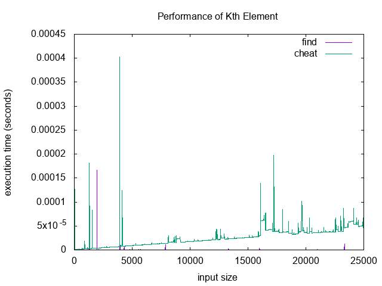

# BAM - Boston Algorithms Meetup

For plotting performance, we're using [gnuplot](http://www.gnuplot.info/).
Check out [a collection of gnuplot
examples](http://alvinalexander.com/technology/gnuplot-charts-graphs-examples).

Here's an example output from our plotting script:



## javascript

```shell
npm install mocha -g # your test runner executable
npm install # installs chai, etc
```

Check out [a gentle TDD
introduction](http://jrsinclair.com/articles/2016/gentle-introduction-to-javascript-tdd-intro/)
for some basic instructions on workflow.
