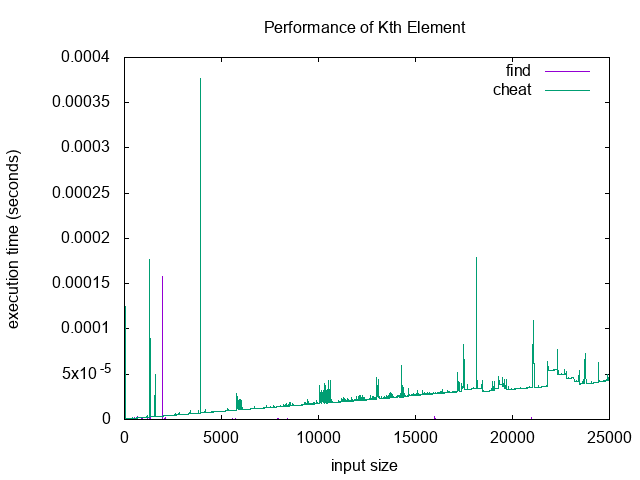

# BAM - Boston Algorithms Meetup

For plotting performance, we're using [gnuplot](http://www.gnuplot.info/).
Check out [a collection of gnuplot
examples](http://alvinalexander.com/technology/gnuplot-charts-graphs-examples).

Here's an example output from our plotting script:



## javascript

```shell
npm install mocha -g # your test runner executable
npm install # installs chai, etc
npm run test # runs test runner
```

## ruby

```shell
gem install bundler # package manager
bundle install # dependencies
rspec # runs test runner
```

## haskell

```shell
curl -sSL https://get.haskellstack.org/ | sh # package manager
stack setup # installs compiler
stack test # runs tests
stack bench # benchmarks
```

## scala

Get [sbt](http://www.scala-sbt.org/download.html), then:
```shell
sbt test # runs tests
sbt run # benchmarks
```


Check out [a gentle TDD
introduction](http://jrsinclair.com/articles/2016/gentle-introduction-to-javascript-tdd-intro/)
for some basic instructions on workflow.
